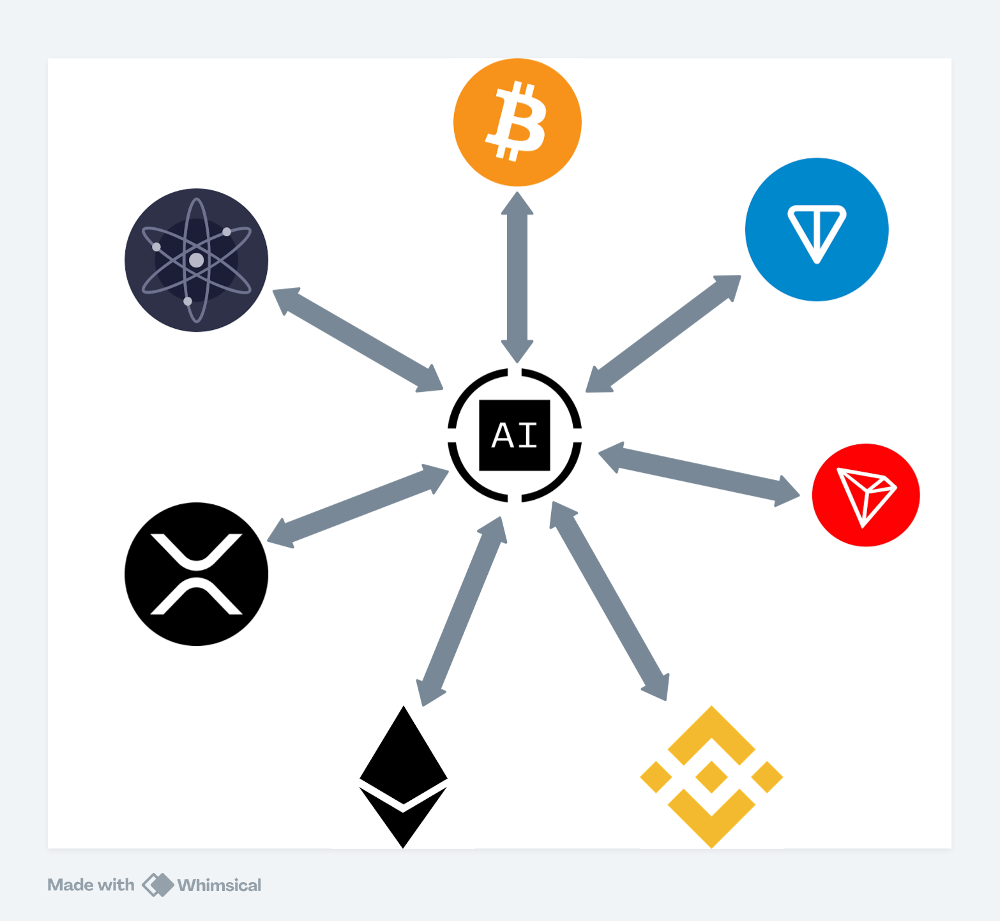

## Introduction

**Obridge** is a cross-chain solution developed by **Oraichain**. It is designed to create a trustless bridge that enables the seamless transfer of assets between Oraichain and various blockchain ecosystems. Obridge supports EVM-compatible chains such as **Tron, BNB Chain, Ethereum**, as well as **XRPL, Bitcoin, Ton**, and the **Cosmos Ecosystem**. This innovative bridge ensures secure and efficient cross-chain communication, providing a decentralized way to move assets across different networks without relying on trusted intermediaries.

### How Obridge Works

1. [Gravity Bridge](https://github.com/oraichain/Gravity-Bridge): OBridge is built on top of the Gravity Bridge, utilizing its robust framework to enable secure and efficient asset transfers between EVM-compatible networks like Ethereum, BNB Chain, and TRON, and the Cosmos ecosystem.

2. [Inter-Blockchain Communication (IBC)](https://github.com/oraichain/ibc-bridge-wasm): OBridge integrates the IBC protocol to ensure seamless asset transfers within the Cosmos ecosystem. This integration maintains security and efficiency without the need for trusted intermediaries, allowing for a more decentralized and trustless environment.

3. [Ton IBC](https://github.com/oraichain/tonbridge-cw-contracts): OBridge establishes an IBC bridge between Ton and Oraichain, leveraging IBC technology to facilitate secure and trustless cross-chain communication and asset transfers.

4. [Cw-Bitcoin](https://github.com/oraichain/cw-bitcoin): The Bitcoin trustless bridge within OBridge is implemented using CosmWasm contracts. This bridge facilitates the use of Taproot Bitcoin scripts, enabling secure and decentralized Bitcoin transfers within the Oraichain ecosystem.

5. [XRPL Bridge](https://github.com/oraichain/cw-xrpl-bridge): OBridge employs a multi-signing account on the XRPL for its bridge. This account holds tokens issued on the XRPL and manages them according to the specific workflow. Depending on the scenario, it either uses the received token balance to send tokens to XRPL accounts (if the account is not an issuer) or mints and sends tokens to XRPL accounts. Multi-signing and public keys associated with each relayer from the contract are used for transaction signing, ensuring security and trustlessness.

### Supported Chains

We currently support the following blockchain platforms:

- **Cosmos-Based Chains:**

  - Cosmoshub
  - Oraichain
  - Osmosis
  - Injective
  - Noble

- **EVM-Based Chains:**

  - Ethereum
  - BNB Chain
  - Tron

- **XRP Ledger**

- **TON - Telegram Open Network**

- **Bitcoin**

### Integration

- [Orai - EVM](./orai-evm.md)
- [Orai - Cosmos](./orai-cosmos.md)
- [Orai - Bitcoin]()
- [Orai - TON](./orai-ton.md)
- [Orai - XRPL]()
