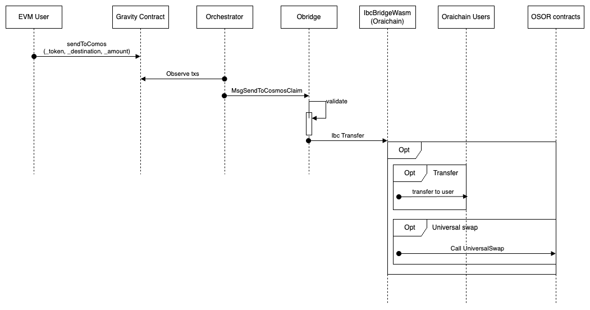
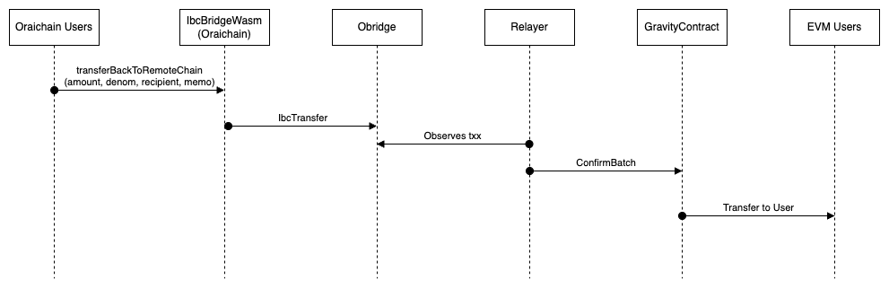

# Oraichain <=> EVM

## Overview

The Oraichain-EVM bridge leverages GravityBridge and IBC Cw20-Ics 20 to enable seamless asset transfers between Oraichain and EVM chains.

| Name                  | Chain     | Address                                                         |
| --------------------- | --------- | --------------------------------------------------------------- |
| Ibc Bridge Wasm       | Oraichain | orai195269awwnt5m6c843q6w7hp8rt0k7syfu9de4h0wz384slshuzps8y7ccm |
| OBridge Contract ETH  | Ethereum  | 0x09Beeedf51AA45718F46837C94712d89B157a9D3                      |
| OBridge Contract BSC  | BNB Chain | 0xb40C364e70bbD98E8aaab707A41a52A2eAF5733f                      |
| Gravity contract Tron | Tron      | 0x73Ddc880916021EFC4754Cb42B53db6EAB1f9D64                      |

## Workflows

### Send from EVM to Oraichain



### Send from Oraichain to EVM



## Integration

### EVM to Oraichain

```solidity
interface IGravity {
    event SendToCosmosEvent(address indexed _tokenContract, address indexe _sender, string _destination, uint256 _amount, uint256 _eventNonce);

    function sendToCosmos(address _tokenContract, string calldata _destination, uint256 _amount) external;
}

```

To bridge tokens from EVM to Oraichain using OBridge, follow these steps:

- Increase allowance for OBridge contract address: Ensure the Gravity contract has the necessary allowance to transfer the tokens
- Call `sendToCosmos` function in OBridge Contract ETH(BSC, TRON):

**Parameters**:

- `_tokenContract` : The address of the token want to bridge.
- `_destination`: A string combining `${sourceChannel}/${destReceiver}:${memo}`, where **sourceChannel** is the bridge channel between OraiBridge and Oraichain, **destReceiver** is the recipient's address on Oraichain, and [memo](./universal-swap-memo.md) used for UniversalSwap
- \_amount: The amount of tokens to bridge.

**Example**: Bridge Orai from the BNB Chain to Oraichain, swaps it for USDC, and then bridges the USDC to Ethereum.

- Init EVM wallet

```ts
import { EvmWallet } from "@oraichain/oraidex-common";
import { Web3Provider } from "@ethersproject/providers";
import { ethers } from "ethers";

window.tronWebDapp = walletType === "owallet" ? window.tronWeb_owallet : window.tronWeb;
window.tronLinkDapp = walletType === "owallet" ? window.tronLink_owallet : window.tronLink;
window.ethereumDapp = walletType === "owallet" ? window.eth_owallet : window.ethereum;

export default class Evm extends EvmWallet {
  private provider: Web3Provider;

  public checkEthereum() {
    if (window.ethereumDapp) return true;
    return false;
  }

  public getSigner() {
    if (!this.provider) this.provider = new ethers.providers.Web3Provider(window.ethereumDapp, "any");
    return this.provider.getSigner();
  }

  public isWindowEthereum() {
    return !!window.ethereumDapp;
  }

  public isTron(chainId: string | number) {
    return Number(chainId) == Networks.tron;
  }

  public checkTron() {
    if (window.tronWebDapp && window.tronLinkDapp) return true;
    return false;
  }

  public async switchNetwork(chainId: string | number) {
    if (this.checkEthereum()) {
      await window.ethereumDapp.request!({
        method: "wallet_switchEthereumChain",
        params: [{ chainId: "0x" + Number(chainId).toString(16) }]
      });
    }
  }

  public async getEthAddress() {
    if (this.checkEthereum()) {
      const [address] = await window.ethereumDapp.request({
        method: "eth_requestAccounts",
        params: []
      });
      return address;
    }
  }
}
```

- Bridge:

```ts
import { Bridge__factory } from "@oraichain/oraidex-common";

const gravityContractAddr = "0xb40C364e70bbD98E8aaab707A41a52A2eAF5733f";
const oraiBscToken = "0xa325ad6d9c92b55a3fc5ad7e412b1518f96441c0";
const destination =
  "channel-1/orai1hvr9d72r5um9lvt0rpkd4r75vrsqtw6yujhqs2:CqMBCgdvcmFpZGV4GpcBCpQBCgczMDAwMDAwEogBCj9vcmFpMTl0dGcwajd3NWtyODNqczMydG13bnd4eGRxOXJrbXc0bTNkN21uMmoyaGtwdWd3d2E0dHN6d3Nua2cSBG9yYWkaP29yYWkxNXVuOG1zeDNuNXpmOWFobHhtZmVxZDJrd2E1d20wbnJweGVyMzA0bTluZDVxNnFxMGc2c2t1NXBkZBIIMTA2NTg4ODUYgN7v8N7wgvUXIokBEoYBCgpjaGFubmVsLTI5EjVldGgtbWFpbm5ldDB4OGM3RTBBODQxMjY5YTAxYzBBYjM4OUNlOEZiM0NmMTUwQTk0RTc5Nxo1ZXRoLW1haW5uZXQweEEwYjg2OTkxYzYyMThiMzZjMWQxOUQ0YTJlOUViMGNFMzYwNmVCNDgggISi7d3wgvUXKgAqK29yYWkxaHZyOWQ3MnI1dW05bHZ0MHJwa2Q0cjc1dnJzcXR3Nnl1amhxczI=";
const amount = "2024699112000000000000";
const from = "0x655169CAc525eC903cd11F8690211C134aeD1C0F";

const gravityContract = Bridge__factory.connect(gravityContractAddr, evmWallet.getSigner());
const result = await gravityContract.sendToCosmos(oraiBscToken, destination, amountVal, { from });
```

### Oraichain to EVM

`Bridging Tokens Using IbcBridgeWasm Contract`

**1. Transfer Native Token**

To bridge native tokens from Oraichain using the IbcBridgeWasm contract, you need to call the `TransferToRemote` message. Here’s how to do it:

- Prepare the `TransferToRemote` message:

  - **local_channel_id**: The IBC channel on Oraichain for sending tokens.
  - **remote_address**: The bech32 address of the recipient on the remote chain (Obridge).
  - **remote_denom**: The denomination of the token on the remote chain, identified from the mapping pair (e.g., `oraib0x...` or `eth-mainnet0x...`).
  - **timeout**: (Optional) The duration in seconds for how long the packet should live. If not specified, it defaults to `default_timeout`.
  - **memo**: The destination address, which must contain the prefix of the destination chain (e.g., `eth-mainnet0x...` or `oraib0x...`).

- **Call the IbcBridgeWasm Contract**:
  - Ensure the corresponding funds match the `remote_denom` in the mapping pair.

**2. Transfer Cw20**
To bridge CW20 tokens from Oraichain to a chain use the CW20 Send function along with the TransferToRemote message

**Example**
Transfer Orai from Oraichain to BNB chain

```ts
import { GasPrice, SigningStargateClient } from "@cosmjs/stargate";
import { DirectSecp256k1HdWallet } from "@cosmjs/proto-signing";
import dotenv from "dotenv";
import { ORAI } from "@oraichain/common";
import { Cw20Ics20Client } from "@oraichain/common-contracts-sdk";
import { TransferBackMsg } from "@oraichain/common-contracts-sdk/build/CwIcs20Latest.types";
import { CwIcs20LatestClient } from "@oraichain/common-contracts-sdk";

const signer = await DirectSecp256k1HdWallet.fromMnemonic(process.env.EXAMPLES_MNEMONIC, { prefix: ORAI }); // replace your mnemonic here
const accounts = await signer.getAccounts();
const address = accounts[0].address;
const client = await SigningStargateClient.connectWithSigner("https://rpc.orai.io", signer, {
  gasPrice: GasPrice.fromString("0.001orai")
});

const ics20Contract = "orai195269awwnt5m6c843q6w7hp8rt0k7syfu9de4h0wz384slshuzps8y7ccm";
const cwIcs20Client = new CwIcs20LatestClient(client, sender, ics20Contract);

const result = await cwIcs20Client.transferToRemote({
  local_channel_id: "channel-29",
  remote_address: "oraib1hvr9d72r5um9lvt0rpkd4r75vrsqtw6ytnnvpf",
  remote_denom: "oraib0xA325Ad6D9c92B55A3Fc5aD7e412B1518F96441C0",
  timeout: "1724320979000000000",
  memo: "oraib0x8ae1874f2f9f26eeecf1855adec19f530e3cdeaa"
});
```
