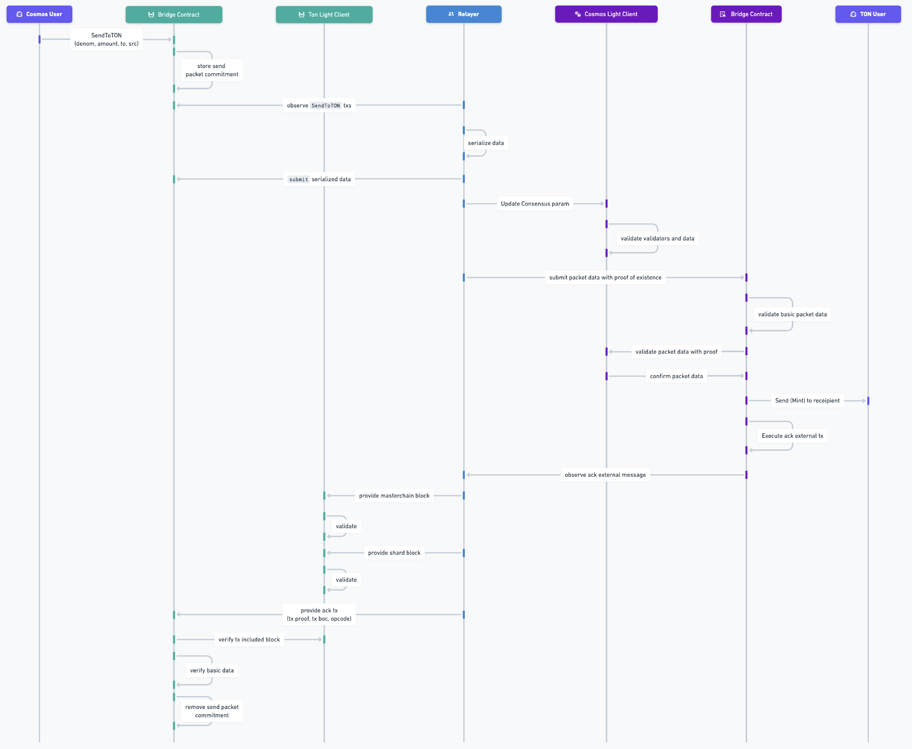

# Oraichain <=> TON

# Overview

The Ton Bridge facilitates the transfer of tokens between the Ton blockchain and Oraichain, as well as other blockchains within the Cosmos ecosystem.

## Ton Contract

| Name           | Address                                          |
| -------------- | ------------------------------------------------ |
| Light Client   | EQDzy_POlimFDyzrHd3OQsb9sZCngyG3O7Za4GRFzM-rrO93 |
| Bridge Adapter | EQC-aFP0rJXwTgKZQJPbPfTSpBFc8wxOgKHWD9cPvOl_DnaY |

## Oraichain Contract

| Name           | Address                                                         |
| -------------- | --------------------------------------------------------------- |
| Light Client   | orai159l8l9c5ckhqpuwdfgs9p4v599nqt3cjlfahalmtrhfuncnec2ms5mz60e |
| Bridge Adapter | orai16crw7g2rcvuga7vlnyxgwtdxtan46k8qqjjwhjqdjvjgk96n95es35q8vm |

# Workflows:

## Send from Ton to Oraichain


<!--  -->

## Send from Oraichain to Ton



# Integration

## Ton to Oraichain

### Bridging Tokens from Ton to Oraichain

You can bridge two types of tokens from Ton to Oraichain:

1. **Ton (Native) Tokens**: This includes the native Ton token.
2. **Jetton Tokens**: This includes tokens like USDT, USDC, and other Jetton-based tokens.

```ts
const TON_NATIVE = "ton";
type JettonMasterAddress = string;
export type TonDenom = typeof TON_NATIVE | JettonMasterAddress;

interface ITonBridgeHandler {
  sendToCosmos(
    cosmosRecipient: string,
    amount: bigint,
    denom: TonDenom,
    opts: ValueOps,
    timeoutTimestamp: bigint = BigInt(calculateTimeoutTimestamp(3600)),
    memo: string = ""
  ): Promise<void>;
}
```

**Notice**:

- If you send native ton to Oraichain, the message will send directly to **Bridge Adapter** contract.
- If you send jetton token to Oraichain, the message will send to **Jetton Wallet** contract first then it will be forwarded to **Bridge Adapter** contract after some messages.

**Parameters**:

- `cosmosRecipient` : recipient address on cosmos destination chain.
- `amount`: amount of token that you want to send.
- `denom`: denom of the token, which will decide it is **bridge_ton** or **bridge_jetton_token**.
- `opts`: configuration of **total ton amount** that you want to send along with the messages and the **query id** of that message.
- `timeoutTimestamp`: timeout timestamp of packet.
- `memo`: [memo](./universal-swap-memo.md) is used for UniversalSwap which will be executed when the token reached to Oraichain.

**Example:**

Here we use `@oraichain/tonbridge-sdk` for interaction.

- Ton Wallet Class:

```ts
export default class TonWallet {
  public constructor(
    public readonly tonClient: TonClient,
    public readonly sender: Sender,
    public readonly publicKey: Buffer
  ) {}

  async waitSeqno(
    seqno: number,
    walletVersion: TonWalletVersion,
    network: Network = "mainnet",
    workchain = MAIN_WORKCHAIN
  ) {
    const walletContract = TonWallet.createWalletContractFromPubKey(
      walletVersion,
      this.publicKey,
      workchain,
      network
    );
    const contract = this.tonClient.open(walletContract);
    let currentSeqno = seqno;
    while (currentSeqno == seqno) {
      console.log("waiting for transaction to confirm...");
      await new Promise((resolve) =>
        setTimeout(resolve, SLEEP_TIME.WAIT_SEQNO)
      );
      const seqno = await contract.getSeqno();
      currentSeqno = seqno;
    }
    console.log("transaction confirmed!");
  }

  static async create(
    network: Network,
    {
      mnemonicData: { mnemonic, tonWalletVersion, workchain },
      tonConnector,
    }: {
      mnemonicData?: {
        mnemonic: string[];
        tonWalletVersion: TonWalletVersion;
        workchain?: number;
      };
      tonConnector?: TonConnectUI;
    }
  ) {
    const endpoint = await getHttpEndpoint({ network });
    const client = new TonClient({ endpoint });
    if (!mnemonic && !tonConnector) {
      throw new Error(
        "Need at least mnemonic or TonConnector to initialize the TON Wallet"
      );
    }
    let tonSender: Sender;
    let tonPublicKey: Buffer;
    if (mnemonic) {
      const { publicKey, secretKey } = await this.getWalletFromMnemonic(
        mnemonic
      );
      tonPublicKey = publicKey;
      const wallet = this.createWalletContractFromPubKey(
        tonWalletVersion,
        tonPublicKey,
        workchain,
        network
      );

      const walletContract = client.open(wallet);
      tonSender = {
        address: walletContract.address,
        ...walletContract.sender(secretKey),
      };
    }
    if (tonConnector) {
      const { sender, account } = this.getWalletFromConnector(tonConnector);
      if (!account.publicKey)
        throw new Error("TonConnector account does not have public key!");
      tonSender = sender;
      tonPublicKey = Buffer.from(account.publicKey, "base64");
    }
    if (!tonPublicKey) throw new Error("TON public key is null");
    return new TonWallet(client, tonSender, tonPublicKey);
  }
  ...
}
```

- Bridge:

```ts
import { COSMOS_CHAIN_IDS, OraiCommon, TON_NATIVE } from "@oraichain/common";
import { toNano } from "@ton/ton";
import { initCosmosWallet } from "./demo-utils"; // refer: https://github.com/oraichain/tonbridge-sdk/blob/main/packages/bridge-sdk/src/demo-utils.ts#L12
import { calculateTimeoutTimestampTon, createTonBridgeHandler, TonWallet } from "@oraichain/ton-bridge-sdk";

export async function main() {
  const oraiMnemonic = <ORAICHAIN_MNEMONIC>;
  const tonMnemonic = <TON_MNEMONIC>;
  const cosmosWallet = initCosmosWallet(oraiMnemonic);
  const tonWallet = await TonWallet.create("mainnet", {
    mnemonicData:
      {
        mnemonic: tonMnemonic.split(" "),
        tonWalletVersion
      },
    tonConnector: undefined,
  }, "V4R2"); // if using on browser, use tonConnector instead of mnemonicData
  const cosmosRpc = (
    await OraiCommon.initializeFromGitRaw({
      chainIds: [COSMOS_CHAIN_IDS.ORAICHAIN]
    })
  ).chainInfos.cosmosChains[0].rpc;
  const handler = await createTonBridgeHandler(cosmosWallet, tonWallet, {
    rpc: cosmosRpc,
    chainId: COSMOS_CHAIN_IDS.ORAICHAIN
  });

  await handler.sendToCosmos(
    handler.wasmBridge.sender,
    toNano(3),
    TON_NATIVE,
    {
      queryId: 0,
      value: toNano(0) // dont care
    },
    calculateTimeoutTimestampTon(3600),
    ""
  );
}

main();
```

**Parameters**:

- `data` : data for building bridge jetton cell.
- `responseAddress`: address for receiving redundant fee ton.
- `queryId`: **query id** of that message.

**Examples:**

```tsx
import { useTonConnectUI } from "@tonconnect/ui-react";
...
const [tonConnectUI] = useTonConnectUI();
...
const memo = beginCell().storeStringRefTail(<memo_string>).endCell();
const getNativeBridgePayload = () =>
        BridgeAdapter.buildBridgeTonBody(
          {
            amount: BigInt(fmtAmount.toString()),
            memo,
            remoteReceiver: oraiAddress,
            timeout,
          },
          oraiAddressBech32,
          {
            queryId: 0,
            value: toNano(0), // don't care this
          }
        ).toBoc();

      const getOtherBridgeTokenPayload = () =>
        JettonWallet.buildSendTransferPacket(
          Address.parse(tonAddress),
          {
            fwdAmount: FWD_AMOUNT,
            jettonAmount: BigInt(fmtAmount.toString()),
            jettonMaster: Address.parse(token.contractAddress),
            remoteReceiver: oraiAddress,
            timeout,
            memo,
            toAddress: bridgeAdapterAddress,
          },
          0
        ).toBoc();

      const boc = isNativeTon
        ? getNativeBridgePayload()
        : getOtherBridgeTokenPayload();

      const tx = await tonConnectUI.sendTransaction({
        validUntil: TON_MESSAGE_VALID_UNTIL,
        messages: [
          {
            address: toAddress, // dia chi token
            amount: gasAmount, // gas
            payload: Base64.encode(boc),
          },
        ],
      });
```

## Oraichain to Ton

```ts
const TON_NATIVE = "ton";
type JettonMasterAddress = string;
export type TonDenom = typeof TON_NATIVE | JettonMasterAddress;

interface ITonBridgeHandler {
  sendToTon(
    tonRecipient: string,
    amount: bigint,
    tokenDenomOnTon: string,
    timeoutTimestamp: bigint = BigInt(calculateTimeoutTimestampTon(3600))
  ): Promise<void>;
}
```

**Parameters**:

- `tonRecipient` : ton recipient address.
- `amount`: amount of token that you want to send.
- `tokenDenomOnTon`: token denom address on ton. With ton native token it will be **ton zero address** and with jetton token, it will be **jetton master address**.
- `timeoutTimestamp`: timeout timestamp of packet.

**Examples:**

Here we use `@oraichain/tonbridge-sdk` for interaction.

- Cosmos Wallet Class:

```ts
abstract class CosmosWallet {
  /**
   * This method should return the cosmos address in bech32 form given a cosmos chain id
   * Browsers should make use of the existing methods from the extension to implement this method
   * @param chainId - Cosmos chain id to parse and return the correct cosmos address
   */
  public abstract getKeplrAddr(chainId?: CosmosChainId): Promise<string>;

  /**
   * This method creates a new cosmos signer which is responsible for signing cosmos-based transactions.
   * Browsers should use signers from the extension to implement this method
   * @param chainId - Cosmos chain id
   */
  public abstract createCosmosSigner(chainId: CosmosChainId): Promise<OfflineSigner>;

  async getCosmWasmClient(
    config: { rpc: string; chainId: CosmosChainId },
    options: SigningStargateClientOptions
  ): Promise<{
    wallet: OfflineSigner;
    client: SigningCosmWasmClient;
    stargateClient: SigningStargateClient;
  }> {
    const { chainId, rpc } = config;
    const wallet = await this.createCosmosSigner(chainId);
    const tmClient = await Tendermint37Client.connect(rpc);
    let client;
    const optionsClient = {
      ...options,
      broadcastPollIntervalMs: BROADCAST_POLL_INTERVAL
    };
    if (chainId === "injective-1") {
      client = await Stargate.InjectiveSigningStargateClient.createWithSigner(
        tmClient as any,
        wallet,
        optionsClient as any
      );
    } else {
      client = await SigningCosmWasmClient.createWithSigner(tmClient, wallet, optionsClient);
    }
    const stargateClient = await SigningStargateClient.createWithSigner(tmClient, wallet, optionsClient);
    return { wallet, client, stargateClient };
  }

  async signAndBroadcast(
    fromChainId: CosmosChainId,
    fromRpc: string,
    options: SigningStargateClientOptions,
    sender: string,
    encodedObjects: EncodeObject[]
  ) {
    // handle sign and broadcast transactions
    const { client } = await this.getCosmWasmClient(
      {
        chainId: fromChainId as CosmosChainId,
        rpc: fromRpc
      },
      options
    );
    return client.signAndBroadcast(sender, encodedObjects, "auto");
  }
}
```

You have to implement the CosmosWallet class.

```ts
References for implement:
- Browser: "https://github.com/oraichain/oraiswap-frontend/blob/main/src/libs/keplr.ts#L11"

- Node.JS: "https://github.com/oraichain/tonbridge-sdk/blob/main/packages/bridge-sdk/src/demo-utils.ts#L12"
```

- Bridge:

```ts
import { COSMOS_CHAIN_IDS, OraiCommon } from "@oraichain/common";
import { toNano } from "@ton/ton";
import { TON_ZERO_ADDRESS } from "./constants";
import { initCosmosWallet } from "./demo-utils"; https://github.com/oraichain/tonbridge-sdk/blob/main/packages/bridge-sdk/src/demo-utils.ts#L12
import { createTonBridgeHandler } from "./utils";

export async function main() {
  const oraiMnemonic = <ORAICHAIN_MNEMONIC>;
  const tonMnemonic = <TON_MNEMONIC>;
  const cosmosWallet = initCosmosWallet(oraiMnemonic);
  const tonWallet = await TonWallet.create("mainnet", {
    mnemonicData:
      {
        mnemonic: tonMnemonic.split(" "),
        tonWalletVersion
      },
    tonConnector: undefined,
  }, "V4R2");
  const cosmosRpc = (
    await OraiCommon.initializeFromGitRaw({
      chainIds: [COSMOS_CHAIN_IDS.ORAICHAIN],
    })
  ).chainInfos.cosmosChains[0].rpc;
  const handler = await createTonBridgeHandler(
    cosmosWallet,
    tonWallet,
    { rpc: cosmosRpc, chainId: COSMOS_CHAIN_IDS.ORAICHAIN }
  );
  const tonReceiveAddress = handler.tonSender.address.toString({
    urlSafe: true,
    bounceable: false,
  });
  console.log(tonReceiveAddress);
  const result = await handler.sendToTon(
    tonReceiveAddress,
    toNano(3),
    TON_ZERO_ADDRESS
  );
  console.log(result);
}

main();
```
