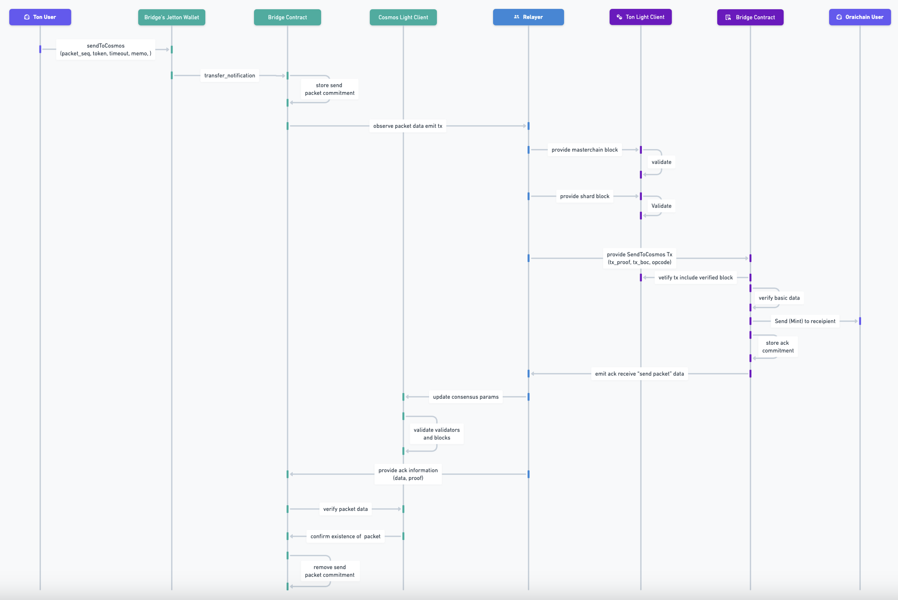

# Oraichain <=> TON

# Overview

The Ton Bridge facilitates the transfer of tokens between the Ton blockchain and Oraichain, as well as other blockchains within the Cosmos ecosystem.

## Ton Contract

| Name           | Address                                          |
| -------------- | ------------------------------------------------ |
| Light Client   | EQDzy_POlimFDyzrHd3OQsb9sZCngyG3O7Za4GRFzM-rrO93 |
| Bridge Adapter | EQC-aFP0rJXwTgKZQJPbPfTSpBFc8wxOgKHWD9cPvOl_DnaY |

## Oraichain Contract

| Name           | Address                                                         |
| -------------- | --------------------------------------------------------------- |
| Light Client   | orai159l8l9c5ckhqpuwdfgs9p4v599nqt3cjlfahalmtrhfuncnec2ms5mz60e |
| Bridge Adapter | orai16crw7g2rcvuga7vlnyxgwtdxtan46k8qqjjwhjqdjvjgk96n95es35q8vm |

# Workflows:

## Send from Ton to Oraichain


<!--  -->

## Send from Oraichain to Ton


# Integration

## Ton to Oraichain

### Bridging Tokens from Ton to Oraichain

You can bridge two types of tokens from Ton to Oraichain:

1. **Ton (Native) Tokens**: This includes the native Ton token.
2. **Jetton Tokens**: This includes tokens like USDT, USDC, and other Jetton-based tokens.

#### Bridging Token to Oraichain

You have to send a message as followed:

```ts
const TON_NATIVE = "ton";
type JettonMasterAddress = string;
export type TonDenom = typeof TON_NATIVE | JettonMasterAddress;

interface ITonBridgeHandler {
  sendToCosmos(
    cosmosRecipient: string,
    amount: bigint,
    denom: TonDenom,
    opts: ValueOps,
    timeoutTimestamp: bigint = BigInt(calculateTimeoutTimestamp(3600)),
    memo: string = ""
  ): Promise<void>;
}
```

**Notice**:

- If you send native ton to Oraichain, the message will send directly to **Bridge Adapter** contract.
- If you send jetton token to Oraichain, the message will send to **Jetton Wallet** contract first then it will be forwarded to **Bridge Adapter** contract after some messages.

**Parameters**:

- `cosmosRecipient` : recipient address on cosmos destination chain
- `amount`: amount of token that you want to send.
- `denom`: denom of the token, which will decide it is **bridge_ton** or **bridge_jetton_token**.
- `opts`: configuration of **total ton amount** that you want to send along with the messages and the **query id** of that message.
- `timeoutTimestamp`: timeout timestamp of packet.
- `memo`: [memo](./universal-swap-memo.md) is used for UniversalSwap which will be executed when the token reached to Oraichain.

**Example:**

```ts
import { COSMOS_CHAIN_IDS, OraiCommon, TON_NATIVE } from "@oraichain/common";
import { toNano } from "@ton/ton";
import { initCosmosWallet, initTonWallet } from "./demo-utils";
import { calculateTimeoutTimestampTon, createTonBridgeHandler } from "./utils";

export async function main() {
  const oraiMnemonic = <ORAICHAIN_MNEMONIC>;
  const tonMnemonic = <TON_MNEMONIC>;
  const cosmosWallet = initCosmosWallet(oraiMnemonic);
  const tonWallet = await initTonWallet(tonMnemonic, "V5R1");
  const cosmosRpc = (
    await OraiCommon.initializeFromGitRaw({
      chainIds: [COSMOS_CHAIN_IDS.ORAICHAIN]
    })
  ).chainInfos.cosmosChains[0].rpc;
  const handler = await createTonBridgeHandler(cosmosWallet, tonWallet, {
    rpc: cosmosRpc,
    chainId: COSMOS_CHAIN_IDS.ORAICHAIN
  });

  await handler.sendToCosmos(
    handler.wasmBridge.sender,
    toNano(3),
    TON_NATIVE,
    {
      queryId: 0,
      value: toNano(0) // dont care
    },
    calculateTimeoutTimestampTon(3600),
    ""
  );
}

main();
```

## Oraichain to Ton

You have to send a message as followed:

```ts
const TON_NATIVE = "ton";
type JettonMasterAddress = string;
export type TonDenom = typeof TON_NATIVE | JettonMasterAddress;

interface ITonBridgeHandler {
  sendToTon(
    tonRecipient: string,
    amount: bigint,
    tokenDenomOnTon: string,
    timeoutTimestamp: bigint = BigInt(calculateTimeoutTimestampTon(3600))
  ): Promise<void>;
}
```

**Parameters**:

- `tonRecipient` : ton recipient address
- `amount`: amount of token that you want to send.
- `tokenDenomOnTon`: token denom address on ton. With ton native token it will be **ton zero address** and with jetton token, it will be **jetton master address**.
- `timeoutTimestamp`: timeout timestamp of packet.

**Examples:**

```ts
import { COSMOS_CHAIN_IDS, OraiCommon } from "@oraichain/common";
import { toNano } from "@ton/ton";
import { TON_ZERO_ADDRESS } from "./constants";
import { initCosmosWallet, initTonWallet } from "./demo-utils";
import { createTonBridgeHandler } from "./utils";

export async function main() {
  const oraiMnemonic = <ORAICHAIN_MNEMONIC>;
  const tonMnemonic = <TON_MNEMONIC>;
  const cosmosWallet = initCosmosWallet(oraiMnemonic);
  const tonWallet = await initTonWallet(tonMnemonic, "V4R2");
  const cosmosRpc = (
    await OraiCommon.initializeFromGitRaw({
      chainIds: [COSMOS_CHAIN_IDS.ORAICHAIN],
    })
  ).chainInfos.cosmosChains[0].rpc;
  const handler = await createTonBridgeHandler(
    cosmosWallet,
    tonWallet,
    { rpc: cosmosRpc, chainId: COSMOS_CHAIN_IDS.ORAICHAIN }
  );
  const tonReceiveAddress = handler.tonSender.address.toString({
    urlSafe: true,
    bounceable: false,
  });
  console.log(tonReceiveAddress);
  const result = await handler.sendToTon(
    tonReceiveAddress,
    toNano(3),
    TON_ZERO_ADDRESS
  );
  console.log(result);
}

main();
```
